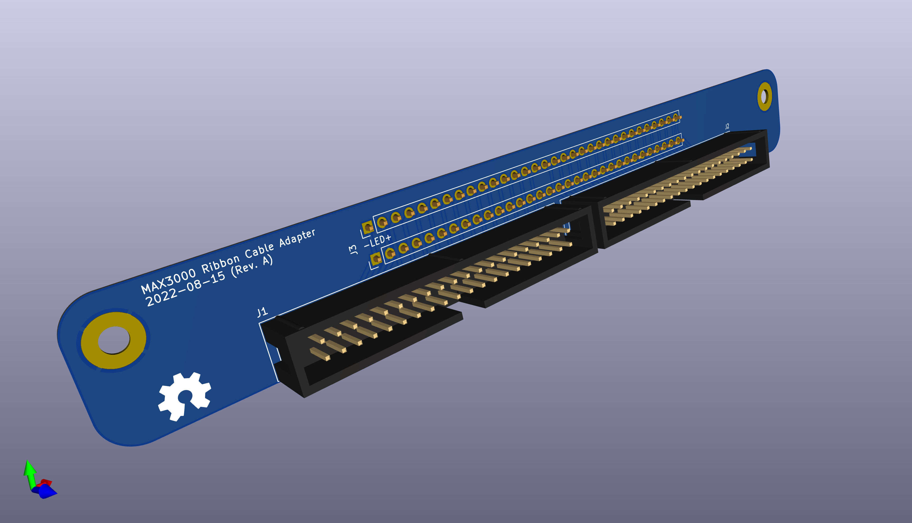

# FlippyAdapter

IDE Ribbon Cable Adapter for the [Luminator MAX3000](https://github.com/NietoSkunk/FlippyDriver) Flip Dot Panel.

This exists to solve an issue with the FlippyDriver, namely that the driver is physically attached to the board and extends outside the footprint of the panel. 

It supports both 34- and 40-pin IDE ribbon cables, or any form of 0.1" IDC connector.



## Cloning repository (with Submodules)

```bash
$ git clone --recurse-submodules git@github.com:NietoSkunk/FlippyAdapter.git
```

## Production notes

* When populating 34-pin IDC connector headers, the connectors should be in the center of the board, such that there are six pins on the outside edges of each connector. 
* The headers may be populated upside down to mechanically fit, although care should be taken to ensure the wiring does not get reversed at the other end of the ribbon cable.
* The two screw holes are M3 sized, and fit a 10mm M3 header to the holes in the board.

## Board Harness

| Pin | # | # | Pin |
| --- | - | - | --- |
| LED- | 1 | 2 | LED- |
| LED+ | 3 | 4 | LED+ |
| ROW_2_RESET | 5 | 6 | ROW_2_SET |
| ROW_4_RESET | 7 | 8 | ROW_4_SET |
| ROW_6_RESET | 9 | 10 | ROW_6_SET |
| ROW_8_RESET | 11 | 12 | ROW_8_SET |
| ROW_10_RESET | 13 | 14 | ROW_10_SET |
| ROW_12_RESET | 15 | 16 | ROW_12_SET |
| ROW_14_RESET | 17 | 18 | ROW_14_SET |
| ROW_16_RESET | 19 | 20 | ROW_16_SET |
| ROW_15_RESET | 21 | 22 | ROW_15_SET |
| ROW_13_RESET | 23 | 24 | ROW_13_SET |
| ROW_11_RESET | 25 | 26 | ROW_11_SET |
| ROW_9_RESET | 27 | 28 | ROW_9_SET |
| ROW_7_RESET | 29 | 30 | ROW_7_SET |
| ROW_5_RESET | 31 | 32 | ROW_5_SET |
| ROW_3_RESET | 33 | 34 | ROW_3_SET |
| ROW_1_RESET | 35 | 36 | ROW_1_SET |
| COL_2 | 37 | 38 | COL_1 |
| COL_4 | 39 | 40 | COL_3 |
| COL_6 | 41 | 42 | COL_5 |
| COL_8 | 43 | 44 | COL_7 |
| COL_10 | 45 | 46 | COL_9 |
| COL_12 | 47 | 48 | COL_11 |
| COL_14 | 49 | 50 | COL_13 |
| COL_16 | 51 | 52 | COL_15 |
| COL_18 | 53 | 54 | COL_17 |
| COL_20 | 55 | 56 | COL_19 |
| COL_22 | 57 | 58 | COL_21 |
| COL_24 | 59 | 60 | COL_23 |
| COL_26 | 61 | 62 | COL_25 |
| COL_28 | 63 | 64 | COL_27 |

## IDC Connectors

| Pin | # | # | Pin |
| --- | - | - | --- |
| N/C | 1 | 2 | N/C |
| N/C | 3 | 4 | N/C |
| N/C | 5 | 6 | N/C |
| LED- | 7 | 8 | LED- |
| LED- | 9 | 10 | LED- |
| LED+ | 11 | 12 | LED+ |
| LED+ | 13 | 14 | LED+ |
| ROW_2_RESET | 15 | 16 | ROW_2_SET |
| ROW_4_RESET | 17 | 18 | ROW_4_SET |
| ROW_6_RESET | 19 | 20 | ROW_6_SET |
| ROW_8_RESET | 21 | 22 | ROW_8_SET |
| ROW_10_RESET | 23 | 24 | ROW_10_SET |
| ROW_12_RESET | 25 | 26 | ROW_12_SET |
| ROW_14_RESET | 27 | 28 | ROW_14_SET |
| ROW_16_RESET | 29 | 30 | ROW_16_SET |
| ROW_15_RESET | 31 | 32 | ROW_15_SET |
| ROW_13_RESET | 33 | 34 | ROW_13_SET |
| ROW_11_RESET | 35 | 36 | ROW_11_SET |
| ROW_9_RESET | 37 | 38 | ROW_9_SET |
| ROW_7_RESET | 39 | 40 | ROW_7_SET |


| Pin | # | # | Pin |
| --- | - | - | --- |
| ROW_5_RESET | 1 | 2 | ROW_5_SET |
| ROW_3_RESET | 3 | 4 | ROW_3_SET |
| ROW_1_RESET | 5 | 6 | ROW_1_SET |
| COL_2 | 7 | 8 | COL_1 |
| COL_4 | 9 | 10 | COL_3 |
| COL_6 | 11 | 12 | COL_5 |
| COL_8 | 13 | 14 | COL_7 |
| COL_10 | 15 | 16 | COL_9 |
| COL_12 | 17 | 18 | COL_11 |
| COL_14 | 19 | 20 | COL_13 |
| COL_16 | 21 | 22 | COL_15 |
| COL_18 | 23 | 24 | COL_17 |
| COL_20 | 25 | 26 | COL_19 |
| COL_22 | 27 | 28 | COL_21 |
| COL_24 | 29 | 30 | COL_23 |
| COL_26 | 31 | 32 | COL_25 |
| COL_28 | 33 | 34 | COL_27 |
| N/C | 35 | 36 | N/C |
| N/C | 37 | 38 | N/C |
| N/C | 39 | 40 | N/C |

